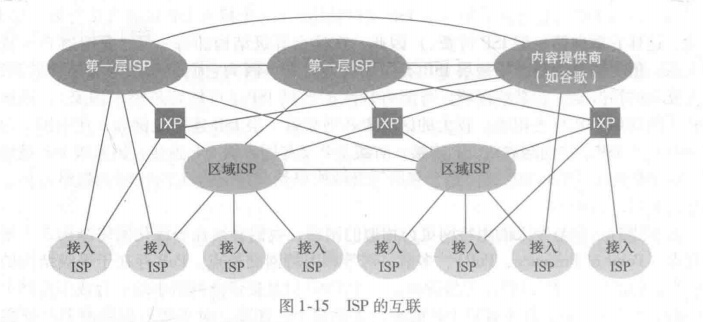

## 什么是因特网？

对于这个问题，*《计算机网络自顶向下方法》*一书中给出了如下两种回答该问题的方式：

*“其一，我们能够描述因特网的具体构成，即构成因特网的基本硬件和软件组件。”*

*“其二，我们能够根据为分布式应用提供服务的联网基础设施来描述因特网。”*

## 网络的网络

构成因特网的“网络的网络”已经演化成了一个非常复杂的结构。这部分内容以逐步递进的方式建造了一系列的网络结构，这部分讲解使得我们可以从宏观上认识网络的组成结构。

**网络结构1**，用单一的全球传输ISP互联所有接入ISP。假想的全球传输ISP是一个路由器和通信链路构成的网络，该网络不仅跨越全球，而且至少具有一台路由器靠近数十万接入ISP中的每一个。显然，这是一个耗资巨大的网络。为了有利可图，自然要向每个接入进来的ISP收费，其价格反映一个接入ISP经过全球ISP交换的流量大小。

**网络结构2**，很显然一个可赢利的全球传输ISP,其他公司建立自己的全球传输ISP并与最初的全球传输ISP竞争则是一件自然的事情。这导致了网络结构2，它由数十万个接入ISP和多个全球传输ISP组成。这些全球传输ISP必须是互联的，不然的话，与某个全球传输ISP连接的接入ISP将不能与连接到其他全球传输ISP的接入ISP进行通信。网络结构2是一种两层的等级结构，其中全球传输提供商位于顶层，而接入ISP位于底层。

**网络结构3**，网络结构3在等级结构中加入了区域ISP一层，现在不仅有多个竞争的第一层ISP,而且在一个区域可能有多个竞争的区域ISP,在这样的等级结构中，每个接入ISP向其连接的区域ISP支付费用，并且每个区域ISP向它连接的第一层ISP支付费用(一个接入ISP也能直接与第一层ISP连接，这样它就向第一层ISP付费)。因此，在这个等级结构中的每一层，都有客户-提供商关系。一个现实的例子，在中国，每个城市有接入ISP,它们与省级ISP相连接，省级ISP又与国家级ISP连接，国家级ISP最终与第一层ISP连接。网络结构3粗略近似于今天的因特网。

**网络结构4**，网络结构4在等级化网络结构3上增加了存在点（Point of Presence,PoP）、多宿、对等和因特网交换点。PoP存在于等级结构的所有层次，除了底层(接入ISP)等级。一个PoP只是提供商网络中的一台或多台路由器群主，其中客户ISP能够与提供商ISP连接。对于要与提供商PoP连接的客户网络，它能从第三方电信提供商租用高速链路将它的路由器之一直接连接到位于该PoP的一台路由器。任何ISP(除了第一层ISP)可以选择多宿(multi-home),即可以与两个或更多个提供商ISP连接。客户ISP为了减少支付给提供商ISP的流量费用，可以直接将它们的网络连接在一起，不通过上游的中间ISP传输。这种相同等级结构层次的一对ISP直连称为对等(peer)。类似的，第三方公司能够创建一个因特网交换点(Internet Exchange Point,IXP)，IXP是一个汇合点，多个ISP能够在这里一起对等。IXP通常位于一个有自己的交换机的独立建筑物中。现在我们可以看到，网络结构4变得复杂起来了，它由接入ISP、区域ISP、第一层ISP、PoP、多宿、对等和IXP组成。

**网络结构5**，如今的因特网结构就是网络结构5所描述的结构。它通过在网络结构4顶部增加内容提供商网络(content provider network)构建而成。谷歌是当前这样的内容提供商网络的一个突出例子。谷歌专用网络通过与较低层的ISP对等，尝试绕过因特网的较高层，采用的方式可以是直接与它们连接。通过创建自己的网络，内容提供商不仅减少了向顶层ISP支付的费用，而且对其服务最终如何交付给端用户有了更多的控制。

